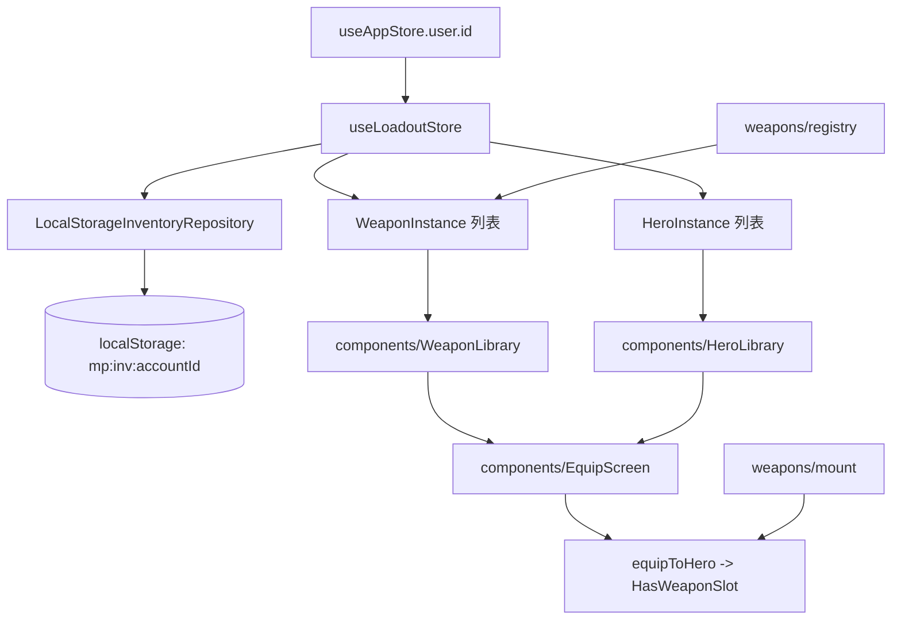

## 用户需求概述

为「保卫阿斗」游戏设计完整的装备与武将体系总览方案，本次聚焦架构设计与主界面 MVP，后续再分阶段细化。

## 核心功能

- 武器系统（已具备静态数据层 54 把武器 / 10 个体系）：本方案补上「实例化仓库」与「装备到武将」能力
- 武将系统（本次一并设计）：数据模型 + 按账号隔离的武将实例库 + 与武器解耦的装配接口
- 账号隔离：每个账号拥有独立武器库与武将库，多账号不互通
- 仓库实例化字段：instanceId（同 ID 可堆叠 count）、refineLevel（强化等级）、affixes（附魔词缀）
- 持久化抽象：IInventoryRepository 接口 + LocalStorageInventoryRepository 实现，远程实现（后端 API）预留
- 主界面 MVP：首屏展示「武器库 / 武将库 / 装备装配」三个分区，可浏览、筛选、装配

## 本期边界（暂不做，但预留接口）

- 后端 Inventory API 与 SQLite 落库
- 铜钱 / 商店 / 抽卡 / 远程同步
- 怪物掉表接入（仅预留挂载点）
- 强化 / 附魔的具体数值结算（仅定义数据结构与计算钩子）

## 技术栈选型

- 沿用现有 frontend 技术栈：React 19 + TypeScript + Vite + Zustand + Phaser（仅数据/界面层，不碰战斗逻辑）
- 持久化：localStorage（通过 Repository 接口隔离，零后端依赖）
- 状态管理：新增 `useLoadoutStore`（Zustand + persist，按 accountId 分桶）

## 实现方案

### 整体策略

在不改动 `GamePlayScene` 战斗逻辑的前提下，于 `frontend/src/game/adou/` 内新增 `inventory/`（仓库）与 `heroes/`（武将）两个独立数据模块，二者通过鸭子类型接口与既有的 `weapons/` 解耦协作；UI 层在 `components/` 下新增主界面与三个分屏，由 Zustand store 驱动。

### 关键设计决策

1. **Repository 抽象**：定义 `IInventoryRepository`，方法含 `load(accountId)` / `save(accountId, state)` / `add` / `remove` / `update`。本地实现用 localStorage 键 `mp:inv:<accountId>`；远程实现仅留接口签名，后续接后端。
2. **账号隔离**：所有仓库读写强制带 `accountId`，store 层从 `useAppStore.user.id` 取当前账号，缺失时回退游客 id。
3. **武器实例模型**：`WeaponInstance { instanceId, weaponId, count, refineLevel, affixes[] }`；同 `weaponId` 普通武器（rarity<=rare）按 `count` 堆叠，稀有以上每把独立 instance。
4. **武将实例模型**：`HeroInstance { instanceId, heroId, level, equippedWeaponInstanceId }`，装备槽只存 weaponInstanceId 引用，避免数据冗余。
5. **装配接口**：复用 `mount.ts` 的 `HasWeaponSlot` 鸭子类型，新增 `equipToHero(hero, weaponInstance)` / `unequipFromHero(hero)` 桥接武将库与武器库。
6. **性能**：仓库读写为 O(n) 内存数组，localStorage 序列化仅在 save 时触发；store 用 `persist` 的分桶 partialize 控制体积；筛选走 `weapons/queryWeapons` 现有能力，避免重复实现。

## 实现要点（防回归）

- 不修改 `registry.ts` / `series.ts` / `damage.ts` 既有导出，仅在 `index.ts` 追加 `export * as Inventory` 与 `export * as Heroes`
- 新增模块保持零循环依赖：`weapons` 不被 `inventory` / `heroes` 反向依赖，`inventory` 单向依赖 `weapons` 的类型与查询
- 账号切换时 store 自动按 accountId 重载对应仓库，避免串号
- 所有 localStorage 访问包 try/catch，解析失败回退空仓库

## 架构设计

### 模块关系

- `weapons/`（已有，静态定义 + 查询）
- `inventory/`（新增，实例仓库 + Repository）
- `heroes/`（新增，武将定义 + 实例库 + 装配）
- `components/`（新增主界面 + 武器库 / 武将库 / 装备屏）
- `store/useLoadoutStore.ts`（新增，Zustand 持久化 + 账号分桶）

### 数据流



## 目录结构（仅列出新增/修改文件）

```
frontend/src/game/adou/
├── inventory/                      # [NEW] 武器仓库模块
│   ├── types.ts                   # WeaponInstance、IInventoryRepository、InventoryState
│   ├── repository.local.ts        # LocalStorageInventoryRepository 实现
│   ├── repository.ts              # Repository 工厂 + 远程实现占位
│   ├── logic.ts                   # add/remove/stack/equip 等纯函数
│   └── index.ts                  # 统一导出
├── heroes/                        # [NEW] 武将模块
│   ├── types.ts                   # HeroDefinition、HeroInstance、HeroSlot
│   ├── registry.ts                # 武将静态定义（对应既有的 9 名武将）
│   ├── logic.ts                   # 武将实例操作 + 装备桥接
│   └── index.ts                  # 统一导出
├── components/                    # [MODIFY/NEW] 界面层
│   ├── GameArmoryScreen.tsx       # [NEW] 主界面（武器库/武将库/装备三分区）
│   ├── WeaponLibrary.tsx          # [NEW] 武器库分屏（筛选/堆叠展示）
│   ├── HeroLibrary.tsx            # [NEW] 武将库分屏
│   └── EquipScreen.tsx            # [NEW] 装备装配分屏
└── index.ts                       # [MODIFY] 追加 Inventory / Heroes 导出
frontend/src/store/
└── useLoadoutStore.ts             # [NEW] Zustand + persist，按 accountId 分桶
frontend/src/game/adou/components/
└── GameStartScreen.tsx            # [MODIFY] 入口增加「进入军械库」按钮跳转主界面
```

## 关键数据结构（补充既有 types）

```ts
// inventory/types.ts
export interface WeaponInstance {
  instanceId: string;
  weaponId: string;
  count: number;            // 堆叠数，独立实例为 1
  refineLevel: number;      // 强化等级，默认 0
  affixes: WeaponAffix[];   // 附魔词缀
}
export interface WeaponAffix {
  id: string;
  stat: "damage" | "attackSpeed" | "range" | "critRate";
  value: number;
}
export interface IInventoryRepository {
  load(accountId: string): Promise<InventoryState>;
  save(accountId: string, state: InventoryState): Promise<void>;
}
export interface InventoryState {
  weapons: WeaponInstance[];
  heroes: HeroInstance[];
}
// heroes/types.ts
export interface HeroDefinition {
  id: string;
  name: string;
  baseWeaponId?: string;   // 默认武器（对应 weapons registry）
  stats: { hp: number; damage: number; cooldown: number };
}
export interface HeroInstance {
  instanceId: string;
  heroId: string;
  level: number;
  equippedWeaponInstanceId: string | null;
}
```

## 设计风格

采用与现有门户一致的深色「军械库」风格：暗色背景、卡片化网格、稀有度配色（普通灰 / 稀有蓝 / 史诗紫 / 传说金），武将与武器用统一卡片组件，装备屏采用左武将、右武器库的双栏布局，hover 有微光描边。

## 页面规划（单一主界面 + 三个分屏区块）

1. 顶部：标题「军械库」+ 当前账号名 + 返回网站
2. 武器库区块：体系筛选 Tab（弓/刀/枪/戟/锤/扇/剑/匕/法器/暗器）+ 武器卡网格，卡面显示名称、体系字、稀有度边框、强化等级、附魔角标
3. 武将库区块：武将卡网格，显示等级、默认武器、已装配状态标记
4. 装备装配区块：左选武将、右选武器实例，确认装配后写回 store

## Agent Extensions

- **lsp-code-analysis**
- Purpose: 在细化实现阶段对 weapons 模块既有导出（registry / mount / types）做符号导航与影响分析，确保新增 inventory / heroes 模块不破坏现有引用
- Expected outcome: 确认所有既有导出签名与调用点，零回归地接入新模块