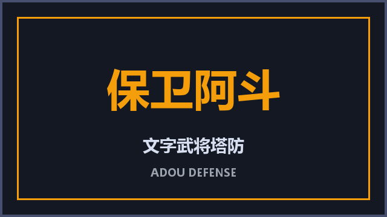
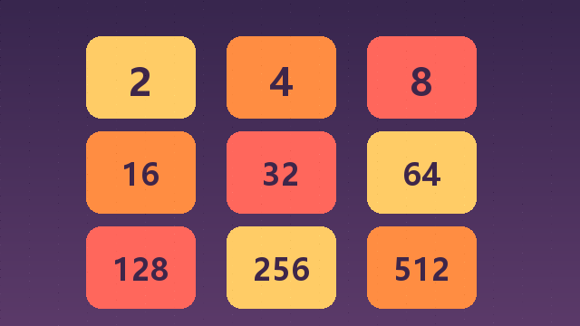
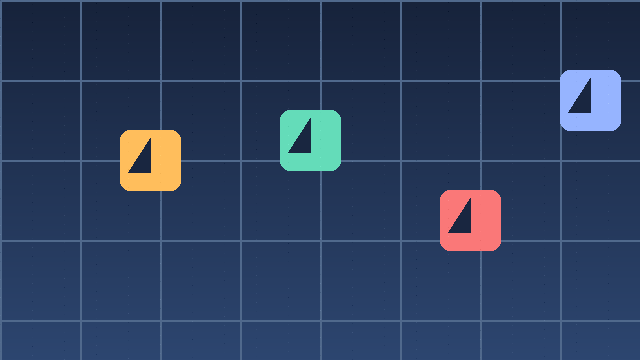
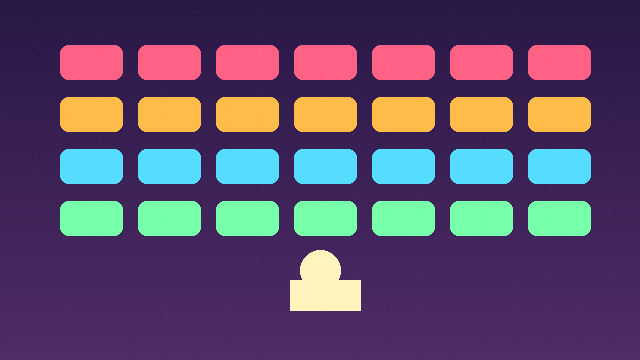
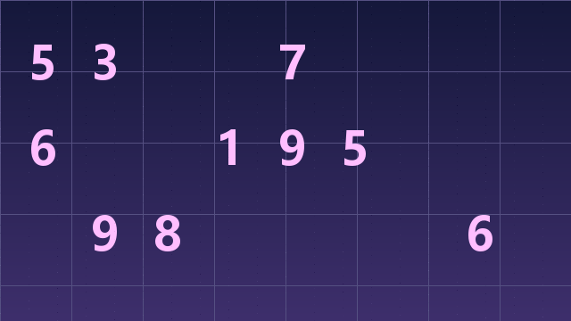

<div align="center">


# 🎮 Mini Playbox

**一个轻量级、可扩展的网页小游戏门户平台**

[](https://react.dev/)
[](https://www.typescriptlang.org/)
[](https://vitejs.dev/)
[](https://phaser.io/)
[](https://sqlite.org/)
[](LICENSE)

[🚀 快速开始](#快速开始) · [🎰 游戏列表](#游戏列表) · [🛠️ 技术栈](#技术栈) · [📂 项目结构](#项目结构) · [🔌 API](#api-接口)

</div>

---

## ✨ 项目简介

**Mini Playbox** 是一个单仓库全栈小游戏门户，提供统一的游戏发现、收藏、搜索与游玩体验。它包含：

- 🌐 **精美的前端门户**：Hero 轮播、分类筛选、搜索排序、收藏夹、明暗主题
- 🧩 **内置多款小游戏**：消除、益智、动作、棋牌、塔防等类型，支持持续扩展
- ⚔️ **保卫阿斗**：用 Phaser 3 自研的文字武将塔防，拥有合成、经济、波次、BOSS 武将系统等完整机制
- 🎖️ **武将养成**：10 名三国武将, 升星 / 上场 / 装备 / 碎片合成, 后端持久化
- 🎰 **招募系统**: 4 个卡池 + 保底机制 + 抽卡历史, 后端持久化
- 🏪 **商店系统**: 金币购买招募券 / 精英符 / 巅峰卷 / 碎片盒
- 🏆 **排行榜**: 全服最好波次排名 (普通 / 闯关双模式)
- 🔐 **用户系统**: 注册 / 登录 / 游客会话 / 修改昵称
- 🗄️ **零依赖后端**：纯 Node.js 内置模块 + SQLite，开箱即用

---

## 🖼️ 界面展示

<div align="center">

| 首页门户 | 游戏详情 | 塔防玩法 |
| :--: | :--: | :--: |
|  |  |  |

</div>

---

## 🎰 游戏列表

当前已收录 **13 款**游戏，更多游戏持续接入中：

| 封面 | 名称 | 类型 | 简介 |
| :--: | :--- | :--- | :--- |
|  | 星轨消消乐 | 消除 | 在轨道上消除同色星球，连击越多得分越高 |
|  | 像素跳跳 | 动作 | 控制小方块跨越平台，节奏逐渐加快 |
|  | 2048 数字合成 | 益智 | 滑动合并相同数字，挑战空间规划能力 |
|  | 扫雷远征 | 益智 | 网格中推理隐藏位置，避开所有地雷 |
|  | 贪吃蛇俱乐部 | 动作 | 经典贪吃蛇加入加速道具与每日挑战 |
|  | 记忆翻牌 | 益智 | 有限步数内翻出全部配对卡片 |
|  | 接龙大师 | 棋牌 | 经典纸牌接龙，支持撤销和自动提示 |
|  | 弹球突围 | 动作 | 拖动挡板击碎砖块，收集掉落的能力球 |
|  | 拼图工坊 | 益智 | 自由调整拼图块数，完成主题拼图 |
|  | 泡泡射手 | 消除 | 瞄准发射彩色泡泡，三个同色即可消除 |
|  | 森林消消 | 消除 | 交换相邻水果，帮助森林恢复生机 |
|  | 数独星空 | 益智 | 经典数独配合星空主题与难度递进 |
|  | **保卫阿斗** | 塔防 | 文字武将塔防，阿斗需要你的守护 |

---

## 🛠️ 技术栈

### 前端

| 技术 | 说明 |
| :--- | :--- |
| [React 19](https://react.dev/) | UI 框架 |
| [TypeScript](https://www.typescriptlang.org/) | 类型安全 |
| [Vite 6](https://vitejs.dev/) | 构建工具 |
| [Zustand](https://github.com/pmndrs/zustand) | 状态管理 |
| [Tailwind CSS](https://tailwindcss.com/) | 样式方案 |
| [Lucide React](https://lucide.dev/) | 图标库 |
| [Phaser 3](https://phaser.io/) | 塔防游戏引擎 |

### 后端

| 技术 | 说明 |
| :--- | :--- |
| Node.js 原生模块 | `http`、`fs`、`crypto`、`node:sqlite` |
| SQLite | 用户与会话数据持久化 |
| `scrypt` | 密码哈希 + 盐值存储 |

---

## 🚀 快速开始

### 环境要求

- [Node.js](https://nodejs.org/) >= 20（需要 `node:sqlite` 支持）
- npm / pnpm（项目使用 npm）

### 1. 安装依赖

```bash
# 安装后端依赖（本仓库后端无第三方依赖，跳过即可）
cd backend

# 安装前端依赖
cd ../frontend
npm install
```

### 2. 启动服务

项目提供了一键启动脚本（Windows PowerShell）：

```powershell
# 在项目根目录执行
.\start.ps1
```

或手动启动：

```bash
# 终端 1：启动后端 API + 静态服务（端口 3001）
cd backend
node server.mjs

# 终端 2：启动前端开发服务器（端口 5173）
cd frontend
npm run dev
```

### 3. 访问

- 开发版前端：`http://localhost:5173`
- 后端 API：`http://localhost:3001`
- API 健康检查：`http://localhost:3001/api/health`

### 4. 停止服务

```powershell
.\stop.ps1
```

---

## 📂 项目结构

```
mini-playbox/
├── backend/
│   ├── server.mjs            # 后端入口（API + 静态服务）
│   ├── data/
│   │   └── app.db            # SQLite 数据库
│   └── package.json          # 后端依赖（实际为空）
├── frontend/
│   ├── public/assets/        # 游戏封面、Hero 图等静态资源
│   ├── src/
│   │   ├── components/       # React 页面组件
│   │   ├── game/
│   │   │   └── adou/         # 保卫阿斗（独立游戏目录）
│   │   │       ├── components/  # 游戏 UI（入口、开始界面、开发控制台）
│   │   │       ├── units/       # 兵种 / 武将 / 僵尸单位
│   │   │       ├── effects/     # 战斗特效
│   │   │       ├── GamePlayScene.ts / FxTestScene.ts
│   │   │       └── index.ts     # 统一导出入口
│   │   ├── store/            # Zustand 全局状态
│   │   ├── data/             # 游戏元数据
│   │   └── types/            # TypeScript 类型定义
│   └── package.json          # 前端依赖
├── start.ps1 / start.cmd     # 一键启动
├── stop.ps1 / stop.cmd       # 一键停止
└── README.md
```

---

## ⚔️ 保卫阿斗：核心玩法

本项目已完整实现一个文字武将塔防小游戏 **《保卫阿斗》**：

- 🏰 **棋盘布阵**：5 × 9 格子战场，拖拽放置不同兵种
- 🧑‍🚀 **武将合成**：收集碎片合成 9 名三国武将（刘备、赵云、关羽、张飞等）
- 🌾 **资源经营**：农场产出"馒头"作为经济来源
- 🌊 **波次防守**：僵尸波次逐步增强，含特殊精英与 BOSS
- 👹 **吕布 BOSS**：每隔数波触发 BOSS 战，具有特殊技能与预警机制
- ✨ **特效系统**：刀光、砍击、命中反馈等战斗特效

> 注意：进入游戏前需要先登录（支持游客登录）。

---

## 🔌 API 接口

后端默认监听 `http://localhost:3001`，主要接口如下：

| 方法 | 路径 | 说明 |
| :--- | :--- | :--- |
| GET | `/api/health` | 健康检查 |
| POST | `/api/guest` | 创建游客会话 |
| POST | `/api/register` | 用户注册 |
| POST | `/api/login` | 用户登录 |
| POST | `/api/logout` | 登出 |
| GET | `/api/me` | 获取当前用户信息 |
| PATCH | `/api/me` | 修改昵称 |

详细实现请查看 `backend/server.mjs`。

---

## 🧩 如何添加新游戏

1. 在 `frontend/src/data/games.ts` 中添加新的游戏元数据
2. 在 `frontend/public/assets/` 添加封面图
3. 在 `frontend/src/components/` 实现游戏组件
4. 在 `GameModal.tsx` 中注册启动入口

---

## 📜 License

本项目基于 [MIT License](LICENSE) 开源。

---

<div align="center">

**Made with ❤️ for mini games.**

</div>
